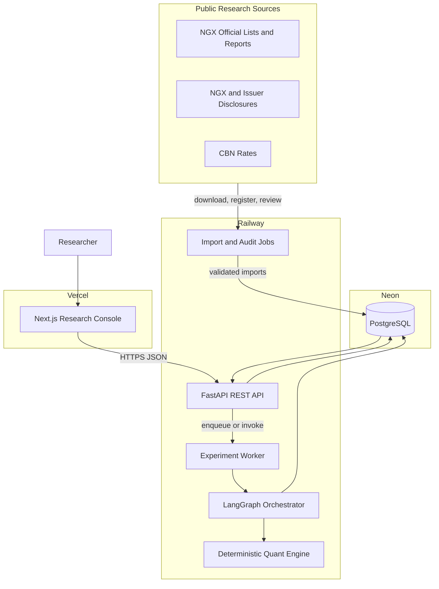
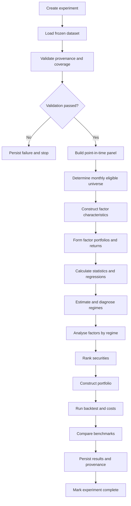

# FactorGraph NGX: Feasible Public-Data Project Plan

## Purpose

This document defines what FactorGraph NGX can responsibly build if the Nigerian Exchange does not waive the historical-data fee and the project does not purchase the quoted dataset.

The proposed solution keeps the supervisor-approved research direction: a graph-orchestrated system for Market, Size, Value, Momentum, and Liquidity analysis of Nigerian Exchange equities. It changes the implementation strategy, not the approved research question. The platform will support a carefully documented public-data pilot and remain capable of accepting a broader licensed dataset later.

The deployment stack is fixed as follows:

- **Frontend:** Next.js and TypeScript, hosted on Vercel.
- **Backend:** Python 3.12 and FastAPI, hosted on Railway.
- **Database:** PostgreSQL hosted on Neon.
- **Quantitative engine:** Pandas, NumPy, SciPy, Statsmodels, scikit-learn, and hmmlearn.
- **Workflow orchestration:** LangGraph coordinating deterministic Python nodes.
- **Package management:** pnpm for the frontend and uv for the backend.

## Executive decision

The project is feasible without purchasing the NGX invoice if it is presented as both:

1. a complete, reusable research software platform; and
2. a pilot empirical evaluation using only observations whose provenance and historical availability can be verified.

It would not be responsible to claim that public sources reproduce the complete paid NGX historical dataset. Public documents appear sufficient to attempt a restricted-universe experiment, but coverage must be measured before the final research universe is frozen.

The platform should therefore support three explicit data modes:

| Mode | Purpose | May appear as research evidence? |
|---|---|---:|
| `demo` | Seeded values for interface development and demonstrations | No |
| `pilot` | Verified public observations from a restricted NGX universe | Yes, with limitations |
| `licensed` | A future official or commercially licensed dataset | Yes, subject to its licence |

Every API response containing analytical results must identify its data mode and dataset version. The web application must visibly label demo data.

## What can be built

### 1. A source-aware research-data pipeline

The platform can ingest CSV files and manually verified extracts from public documents, normalise them into canonical tables, reject unsafe observations, and preserve their provenance.

Each source file or manual extract will be registered with:

```text
source_name
source_url
source_document
downloaded_at
file_hash
coverage_start
coverage_end
licence_or_usage_note
extraction_method
review_status
reviewed_by
```

This makes the evidence traceable even when the input is assembled from multiple public sources.

### 2. A restricted-universe empirical pilot

The public-data experiment can use a subset of companies that pass predefined eligibility and coverage rules. A candidate list may begin with approximately 15 cross-sector companies, but membership must be determined by the audit rather than by current popularity, current market capitalisation, or subjective ideas about desirable companies.

At each portfolio formation date, a security should be eligible only when it:

- was listed and tradeable on that date;
- has sufficient prior price history for the selected calculation;
- has sufficient daily traded-value observations for the liquidity measure;
- has a valid market-capitalisation observation;
- has a point-in-time-valid book-equity observation for the value signal; and
- passes documented price, missingness, and trading-frequency rules.

This dynamic universe is preferable to requiring all companies to survive for the complete period. A static survivor-only universe would be simpler, but it could create survivorship bias and would have to be described as an engineering pilot rather than a market-representative test.

### 3. Point-in-time fundamental alignment

The system can store a fiscal period separately from the date on which the information became available.

```text
effective_from = publication_date
```

If an actual publication date cannot be recovered, the system may apply the supervisor-approved fixed-lag rule:

```text
effective_from = fiscal_period_end + configured_lag_days
effective_date_source = FIXED_LAG_ESTIMATE
```

Actual and estimated dates must never be mixed without labels. The audit should report the percentage of fundamental observations using each method.

### 4. Deterministic factor construction

The system can calculate the five approved factors when the required inputs are available:

| Factor | Required inputs | Output |
|---|---|---|
| Market | NGX ASI return and risk-free return | `MKT = Rm - Rf` |
| Size | formation-date market capitalisation and subsequent security returns | small-portfolio return minus large-portfolio return |
| Value | point-in-time book equity, market capitalisation, and subsequent returns | high book-to-market return minus low book-to-market return |
| Momentum | at least 12 months of prior prices and subsequent returns | winner return minus loser return using the 12–1 rule |
| Liquidity | daily returns, daily traded value, and subsequent returns | return spread based on a documented liquidity ranking |

Size and Value must be return spreads, not averages of signed characteristics. Momentum must use the cumulative return from month `t-12` through `t-2`. The Amihud-style liquidity characteristic must use monetary traded value:

```text
ILLIQ_i,t = mean(|daily_return_i,d| / trading_value_i,d)
```

The orientation of the Liquidity factor—such as illiquid minus liquid—must be stated once and used consistently.

Because the pilot universe may be small, the default portfolio breakpoints should be simple halves or terciles. More complex independent intersections should only be enabled when every portfolio contains enough eligible securities.

### 5. Statistical validation

For each factor return series, the backend can calculate:

- number of usable observations;
- arithmetic mean;
- annualised return and volatility;
- Sharpe ratio using a stated convention;
- maximum drawdown;
- Newey-West-adjusted t-statistic;
- bootstrap confidence interval with a stored random seed; and
- regression coefficients, standard errors, t-statistics, p-values, and adjusted fit measures.

The software must report insufficient data instead of manufacturing a statistic. Passing a statistical threshold does not prove economic usefulness, and failure to pass does not invalidate the software.

### 6. Regime analysis

The platform can estimate a Gaussian Hidden Markov Model using monthly NGX market returns and rolling volatility. It can persist:

- fitted state assignments;
- filtered or posterior probabilities;
- transition matrix;
- state mean and volatility;
- state persistence;
- convergence status;
- training window and random seed; and
- observations per state.

A descriptive full-sample HMM may be used to explain the historical sample. Any regime value used to make a simulated portfolio decision must be estimated using only information available at that date. These two uses must be labelled separately.

Sixty or seventy-two monthly observations do not guarantee a stable three-state model. Weak separation, non-convergence, or sparse states are valid findings and should be reported. The implementation should compare multiple stored initialisation seeds and retain the converged model with the highest likelihood under a predeclared rule.

### 7. Portfolio simulation

The system can standardise Size, Value, Momentum, and Liquidity characteristics within the eligible cross-section, calculate a composite score, select the highest-ranked securities, and form an equal-weight, long-only portfolio.

The backtest can report:

- holdings and formation-date signals;
- weights and subsequent returns;
- turnover;
- gross return;
- estimated trading cost;
- net return;
- cumulative performance;
- volatility and Sharpe ratio;
- maximum drawdown; and
- comparison with the NGX All-Share Index.

Initial purchases and later rebalances must follow a stated turnover convention. Zero-cost results may be shown as a diagnostic, but the primary portfolio result should include a recorded cost assumption and at least one higher-cost sensitivity case.

### 8. Reproducible experiments

Every run should preserve:

```text
experiment_id
dataset_version_id
data_mode
date_range
eligible_universe_rule
factor_configuration
regime_configuration
portfolio_configuration
transaction_cost_configuration
random_seeds
software_revision
status
node_execution_log
created_at
completed_at
```

Repeating a completed experiment with the same source snapshot, configuration, seeds, and software revision should reproduce its numerical outputs within stored tolerances.

## What cannot be promised from public data

Unless the coverage audit proves otherwise, the project must not promise:

- a complete census of all NGX equities and delisted securities from 2018–2025;
- complete corporate-action-adjusted price histories;
- complete listing, suspension, and delisting histories;
- a historically accurate universe at every formation date;
- complete historical shares outstanding for every issuer;
- a data dictionary supplied by NGX;
- conclusions that generalise to the entire NGX market;
- causal claims about any factor;
- live trading or investment recommendations; or
- evidence that graph orchestration improves investment returns.

The graph improves separation, traceability, repeatability, and failure reporting. Its software-engineering value is distinct from financial performance.

## Public-data feasibility

### NGX trading and reference data

The [NGX Data Library](https://ngxgroup.com/exchange/data/data-library/) currently lists downloadable categories including Daily Official Lists for equities, index reports, market-capitalisation reports, and shares-outstanding reports. The [public equities price page](https://ngxgroup.com/exchange/data/equities-price-list/) exposes open, high, low, close, trades, volume, value, and trade date for current delayed observations.

Individual Daily Official List PDFs can contain security names, prices, business-done fields, dividend information, EPS, and P/E data. Their structure may vary and PDF extraction may be unreliable. A document being discoverable does not establish continuous coverage for the complete research period.

The [NGX X-DataPortal](https://ngxgroup.com/exchange/data/x-dataportal/) states that free access is limited to seven days of historical price data. Its broader historical product is therefore not assumed to be free.

Public NGX files should be treated as candidate source documents subject to coverage, consistency, and usage-condition review—not as an undocumented scraping API.

### Financial statements and publication dates

The [NGX Corporate Disclosures portal](https://ngxgroup.com/exchange/data/corporate-disclosures/) publishes issuer disclosures with submission dates. Issuer investor-relations sites can supplement missing reports. The [NGX X-Compliance report](https://ngxgroup.com/exchange/trade/investor-protection-education/x-compliance-report/) also provides information about released and delinquent financial statements.

For each annual or interim statement, extraction should capture:

```text
ticker_or_issuer
fiscal_period
publication_date
book_equity
shares_outstanding
currency
unit_scale
consolidated_or_separate
source_url
source_page
review_status
```

The consolidated attributable-equity definition used for book equity must be documented and applied consistently. Values taken from PDFs should require human verification before they become research-grade observations.

### Risk-free rate

The [Central Bank of Nigeria Money Market Indicators](https://www.cbn.gov.ng/rates/mnymktind.html) distinguish the Treasury Bill Rate from the Monetary Policy Rate. The project should select a Treasury-bill-based proxy, define its tenor, and convert the annualised percentage into the return frequency used by the model.

The MPR should not silently substitute for a Treasury-bill return. If only a lower-frequency series is recoverable, its alignment and forward-fill limits must be explicit.

### Benchmark

The NGX All-Share Index is required for the Market factor and benchmark comparison. Candidate sources include public NGX index reports and Daily Official Lists. The audit must verify the level, date, frequency, and completeness before the series is accepted.

### Corporate actions and identifier history

Ticker changes, holding-company conversions, mergers, rights issues, bonus issues, splits, suspensions, and delistings can break naive historical joins. Examples such as GTBank/GTCO and Access Bank/Access Holdings must be represented as identifier-history or successor events rather than silently treated as identical tickers.

When an adjustment factor is unavailable, the system should:

1. preserve the raw close;
2. record known corporate events;
3. flag suspicious return jumps;
4. apply an adjustment only when its method and source are documented; and
5. exclude an affected observation or security when the return cannot be made defensible.

## Dataset audit before collection

The first empirical milestone is a coverage audit, not a full scrape.

Begin with three issuers from different sectors. For each issuer, test whether the following can be recovered for a limited interval:

| Dataset | Minimum audit fields |
|---|---|
| Daily prices | ticker, date, close, volume, traded value |
| Reference data | issuer, sector, ISIN where available |
| Fundamentals | fiscal period, publication date, book equity, shares outstanding |
| Benchmark | date and NGX ASI level |
| Risk-free | observation date, tenor, annualised rate |
| Events | event date, event type, source |

The audit output should include:

- expected and recovered dates;
- missing-date percentage;
- duplicate count;
- zero-volume and zero-value frequency;
- unexplained price jumps;
- earliest valid momentum formation date;
- count of actual and estimated publication dates;
- years with valid book equity and shares outstanding; and
- source and extraction notes.

Only after this audit should the project expand toward the candidate pilot universe.

## Proposed architecture



### Architecture principles

1. **Deterministic computation:** factor values and portfolio decisions come from versioned Python functions.
2. **Orchestration without financial discretion:** LangGraph controls dependency order and state transfer; it does not invent data or override formulas.
3. **Immutable source snapshots:** an experiment points to a frozen dataset version.
4. **Point-in-time access:** a node may use only observations available by its simulated decision date.
5. **Failure isolation:** a failed validation node prevents downstream results from being marked complete.
6. **Asynchronous experiments:** expensive calculations should not hold an HTTP request open.
7. **Thin frontend:** the browser visualises typed API results; it does not calculate research statistics.
8. **Explicit uncertainty:** missing or insufficient data is represented in the result model.

## Proposed monorepo structure

The current repository already has the main `apps/web` and `apps/api` boundaries. The following structure evolves it without introducing unnecessary services:

```text
factorgraph-ngx/
├── apps/
│   ├── web/
│   │   ├── app/
│   │   │   ├── dashboard/
│   │   │   ├── datasets/
│   │   │   ├── companies/
│   │   │   ├── factors/
│   │   │   ├── regimes/
│   │   │   ├── portfolio/
│   │   │   └── experiments/
│   │   ├── components/
│   │   │   ├── charts/
│   │   │   ├── data-quality/
│   │   │   ├── experiments/
│   │   │   └── ui/
│   │   ├── lib/
│   │   │   ├── api/
│   │   │   ├── formatting/
│   │   │   └── validation/
│   │   ├── types/
│   │   ├── public/
│   │   └── package.json
│   │
│   └── api/
│       ├── app/
│       │   ├── api/
│       │   │   ├── datasets.py
│       │   │   ├── companies.py
│       │   │   ├── factors.py
│       │   │   ├── regimes.py
│       │   │   ├── portfolios.py
│       │   │   └── experiments.py
│       │   ├── core/
│       │   │   ├── config.py
│       │   │   ├── logging.py
│       │   │   └── exceptions.py
│       │   ├── data/
│       │   │   ├── contracts.py
│       │   │   ├── ingestion.py
│       │   │   ├── cleaning.py
│       │   │   ├── validation.py
│       │   │   ├── alignment.py
│       │   │   ├── eligibility.py
│       │   │   └── provenance.py
│       │   ├── factors/
│       │   │   ├── base.py
│       │   │   ├── market.py
│       │   │   ├── size.py
│       │   │   ├── value.py
│       │   │   ├── momentum.py
│       │   │   └── liquidity.py
│       │   ├── quant/
│       │   │   ├── returns.py
│       │   │   ├── statistics.py
│       │   │   ├── regressions.py
│       │   │   ├── bootstrap.py
│       │   │   ├── regimes.py
│       │   │   ├── scoring.py
│       │   │   ├── portfolio.py
│       │   │   ├── transaction_costs.py
│       │   │   └── backtest.py
│       │   ├── graph/
│       │   │   ├── state.py
│       │   │   ├── nodes/
│       │   │   └── graph.py
│       │   ├── services/
│       │   │   ├── datasets.py
│       │   │   ├── experiments.py
│       │   │   └── result_queries.py
│       │   ├── db/
│       │   │   ├── models/
│       │   │   ├── repositories/
│       │   │   └── session.py
│       │   ├── workers/
│       │   │   └── experiments.py
│       │   └── main.py
│       ├── alembic/
│       ├── scripts/
│       │   ├── audit_sources.py
│       │   ├── register_source.py
│       │   ├── import_prices.py
│       │   ├── import_fundamentals.py
│       │   ├── import_benchmark.py
│       │   ├── import_risk_free.py
│       │   ├── freeze_dataset.py
│       │   └── run_experiment.py
│       ├── tests/
│       │   ├── fixtures/
│       │   ├── unit/
│       │   ├── component/
│       │   └── integration/
│       ├── Dockerfile
│       ├── railway.toml
│       └── pyproject.toml
│
├── data/
│   ├── manifests/
│   ├── templates/
│   ├── raw/.gitkeep
│   ├── staged/.gitkeep
│   ├── processed/.gitkeep
│   └── README.md
│
├── docs/
│   ├── architecture.md
│   ├── methodology.md
│   ├── data-sources.md
│   ├── data-dictionary.md
│   └── operations.md
│
├── documentation/
│   ├── CHAPTER-ONE.md
│   ├── CHAPTER-TWO.md
│   └── CHAPTER-THREE.md
│
├── research/
│   ├── audit-results/
│   ├── experiment-configs/
│   ├── exported-tables/
│   └── notebooks/
│
├── .github/workflows/
├── FEASIBLE_PROJECT.md
├── README.md
├── package.json
├── pnpm-lock.yaml
└── pnpm-workspace.yaml
```

Raw licensed or restricted documents must remain outside Git. Manifests, hashes, schemas, small manually constructed test fixtures, and derived aggregate outputs may be committed when their source terms permit it.

## Canonical data contracts

### Prices

```csv
ticker,trading_date,open,high,low,close,adjusted_close,volume,trading_value,number_of_transactions,dataset_version_id
```

Required for the first usable pilot: `ticker`, `trading_date`, `close`, and `trading_value`. Volume is strongly preferred. OHLC and transactions are useful but are not required by the current factor definitions.

### Fundamentals

```csv
ticker,fiscal_period,publication_date,effective_from,effective_date_source,book_equity,shares_outstanding,currency,unit_scale,source_document,dataset_version_id
```

### Benchmark

```csv
benchmark_code,trading_date,close,adjusted_close,dataset_version_id
```

### Risk-free rate

```csv
observation_date,tenor,annualized_rate,rate_basis,source_document,dataset_version_id
```

### Corporate actions

```csv
ticker,action_date,action_type,adjustment_factor,cash_amount,details,source_document,dataset_version_id
```

### Security identifiers

```csv
company_id,ticker,isin,valid_from,valid_to,is_primary,predecessor_or_successor_note
```

## Database design

The existing migration provides a useful foundation, but full experiment persistence requires additional tables.

### Source and dataset tables

| Table | Responsibility |
|---|---|
| `source_files` | URL, hash, download metadata, coverage, and review status |
| `dataset_versions` | Immutable logical snapshot and manifest |
| `dataset_version_sources` | Many-to-many link between a dataset version and source files |
| `data_quality_results` | Rule-level counts and audit findings |

### Canonical observation tables

| Table | Responsibility |
|---|---|
| `companies` | Stable issuer identity |
| `security_identifiers` | Historical ticker and ISIN validity |
| `price_observations` | Daily security observations |
| `fundamental_observations` | Fiscal values and effective dates |
| `corporate_actions` | Events affecting identity, shares, cash flows, or prices |
| `benchmark_observations` | NGX ASI and optional comparison indices |
| `risk_free_observations` | Dated rate by tenor |

### Research-result tables

| Table | Responsibility |
|---|---|
| `experiments` | Configuration, status, dataset, revision, and timestamps |
| `experiment_nodes` | Node status, start/end time, inputs, outputs, and error summary |
| `factor_observations` | Dated factor returns and portfolio membership metadata |
| `factor_statistics` | Descriptive, Newey-West, bootstrap, and regression results |
| `regime_observations` | State and probabilities by month |
| `regime_statistics` | State characteristics and transition matrix |
| `security_scores` | Formation-date characteristics, z-scores, and composite score |
| `portfolio_holdings` | Formation-date holdings and weights |
| `portfolio_returns` | Gross return, turnover, cost, net return, and benchmark return |

Large raw PDFs should not be stored in PostgreSQL. Store a reference, content hash, and extracted canonical observations.

## Research workflow



LangGraph state should carry database identifiers and compact metadata rather than large Pandas dataframes when possible. Large intermediate data can be reconstructed from the frozen dataset or stored as versioned artifacts with hashes.

## API surface

All routes use `/api/v1`.

### Health and metadata

```http
GET /health
GET /metadata/data-modes
GET /metadata/methodology
```

### Datasets

```http
GET  /datasets
POST /datasets
GET  /datasets/{dataset_id}
GET  /datasets/{dataset_id}/coverage
GET  /datasets/{dataset_id}/quality
POST /datasets/{dataset_id}/freeze
```

### Companies

```http
GET /companies
GET /companies/{ticker}
GET /companies/{ticker}/prices
GET /companies/{ticker}/fundamentals
GET /companies/{ticker}/events
```

### Experiments

```http
POST /experiments
GET  /experiments
GET  /experiments/{experiment_id}
POST /experiments/{experiment_id}/run
GET  /experiments/{experiment_id}/nodes
GET  /experiments/{experiment_id}/provenance
```

### Results

```http
GET /experiments/{experiment_id}/factors
GET /experiments/{experiment_id}/regimes
GET /experiments/{experiment_id}/scores
GET /experiments/{experiment_id}/portfolio
GET /experiments/{experiment_id}/performance
GET /experiments/{experiment_id}/exports
```

The run endpoint should return quickly with an accepted or running status. The frontend should poll the experiment status or use server-sent events later if live node progress becomes necessary.

## Frontend views

### Landing page

Explain the research question, deterministic methodology, data provenance, and academic limitation. Avoid showing demo performance without a demo label.

### Dataset audit

Show:

- source files and review status;
- coverage by security and year;
- missing observations;
- actual versus estimated publication dates;
- corporate-action warnings; and
- the frozen dataset version.

### Dashboard

Show the selected experiment, its data mode, eligible universe, date range, workflow status, principal factor statistics, current descriptive regime, and portfolio-versus-benchmark summary.

### Factor laboratory

Show formulas, portfolio construction rules, factor history, confidence intervals, Newey-West results, constituent counts, and missing-data warnings.

### Regimes

Show the state timeline, posterior probabilities, transition matrix, state observation counts, convergence information, and regime-conditioned factor results.

### Portfolio

Show formation-date signals, composite scores, holdings, weights, turnover, gross and net performance, cost sensitivity, and benchmark comparison.

### Experiments

Allow configuration and inspection of saved runs. The interface should never imply that clicking “run” completed an experiment until the backend has persisted a completed status.

## Deployment design

### Vercel frontend

Vercel’s official [monorepo documentation](https://vercel.com/docs/monorepos) supports choosing a project root directory. Configure the Vercel project with:

```text
Root Directory: apps/web
Framework: Next.js
Install Command: pnpm install --frozen-lockfile
Build Command: pnpm build
```

Required variable:

```env
NEXT_PUBLIC_API_URL=https://<railway-api-domain>/api/v1
```

Values prefixed with `NEXT_PUBLIC_` are bundled into client code and are public. Database credentials and private tokens must never use that prefix or be configured in the frontend project.

### Railway API and worker

Railway’s official [FastAPI guide](https://docs.railway.com/guides/fastapi) supports GitHub and Dockerfile deployment. The service should use:

```text
Root Directory: apps/api
Build: Dockerfile
Start: uv run uvicorn app.main:app --host 0.0.0.0 --port $PORT
Healthcheck: /api/v1/health
```

Railway supports persistent services, workers, and cron jobs. The smallest initial deployment can run experiments in the API process while preventing concurrent runs. Before experiments become slow or multi-user, create a second Railway service from the same `apps/api` source with a worker start command.

Suggested services:

| Service | Process |
|---|---|
| `factorgraph-api` | FastAPI web service |
| `factorgraph-worker` | Claims queued experiments and executes the graph |
| `factorgraph-audit` | Optional manually triggered or scheduled audit/import job |

Railway cron jobs are expected to run and exit. They are suitable for a periodic source audit, but the research project does not require automatic daily scraping.

Backend variables:

```env
APP_ENV=production
DATABASE_URL=<neon-pooled-runtime-url>
MIGRATION_DATABASE_URL=<neon-direct-url>
FRONTEND_URL=https://<vercel-domain>
BOOTSTRAP_ITERATIONS=10000
DEFAULT_REGIME_COUNT=3
DEFAULT_PORTFOLIO_SIZE=10
FUNDAMENTAL_REPORTING_LAG_DAYS=90
LOG_LEVEL=INFO
```

### Neon PostgreSQL

Use a pooled Neon connection for normal API and worker traffic. Neon’s [connection-pooling guidance](https://neon.com/docs/connect/connection-pooling) recommends a direct connection for ORM migrations, so Alembic should use `MIGRATION_DATABASE_URL`.

Recommended branches:

```text
main      production data and completed experiments
staging   migration and integration validation
```

Neon branching can isolate migration testing. It does not replace source-file manifests or dataset versions: database history and research-data provenance solve different problems.

## Security and research integrity

- Keep `.env`, raw restricted files, credentials, and tokens out of Git.
- Restrict CORS to the deployed Vercel origin and required preview origins.
- Validate upload size, extension, schema, and content before import.
- Hash every source file before transformation.
- Use database constraints and transactions for canonical imports.
- Do not accept public URLs from arbitrary users for server-side fetching without strict allow-listing.
- Do not expose database credentials to the browser.
- Do not render generated text as a quantitative result.
- Do not overwrite completed experiment inputs or outputs.
- Preserve failed runs and validation reasons.
- Label every chart with experiment ID, dataset version, data mode, and date range.

## Testing strategy

### Unit tests

Use small manually verifiable frames for:

- return calculations;
- market-capitalisation and book-to-market characteristics;
- 12–1 momentum boundaries;
- Amihud illiquidity;
- breakpoint membership;
- factor portfolio returns;
- point-in-time fundamental selection;
- Newey-West outputs;
- bootstrap reproducibility;
- turnover and transaction costs; and
- drawdown.

### Component tests

Test connected stages such as source registration → normalisation → validation → import, and characteristics → ranks → portfolio returns.

### Integration tests

Run a complete experiment using a small artificial dataset whose expected results can be calculated independently. Verify node order, failure stopping, dataset identity, result persistence, and repeatability.

### Data-quality tests

Run against each pilot snapshot:

- natural-key uniqueness;
- positive prices;
- non-negative volume and value;
- OHLC consistency where fields exist;
- valid identifier periods;
- effective date not preceding an actual publication date;
- no future fundamentals in formation records;
- no portfolio return using same-period formation information; and
- reasonable return-jump flags around corporate actions.

### Deployment checks

- frontend typecheck and production build;
- backend lint and tests;
- Alembic migration check against a non-production Neon branch;
- Railway healthcheck;
- browser-to-API CORS check; and
- a read-only production smoke test.

## Delivery phases

### Phase 0: Align documentation

- Update the repository README to distinguish current, planned, demo, and research functionality.
- Keep supervisor-approved Chapters One–Three unchanged until a material scope change is approved.
- Add the canonical data dictionary and source-manifest format.

**Exit condition:** repository claims match the implementation and approved methodology.

### Phase 1: Three-company feasibility audit

- Select three cross-sector issuers.
- Collect a limited sample of prices, traded value, reports, publication dates, benchmark, and risk-free data.
- Produce a coverage report and extraction log.
- Validate one month and one fiscal period manually.

**Exit condition:** the team can prove whether public documents support the canonical inputs.

### Phase 2: Data foundation

- Implement source registration, hashing, validation, canonical imports, identifier history, and dataset freezing.
- Add missing source and quality tables.
- Implement point-in-time selection tests.

**Exit condition:** `pilot_v1` can be reproduced from registered sources.

### Phase 3: Correct quantitative engine

- Implement factor characteristics and return-spread construction.
- Implement statistical validation, benchmark regressions, HMM estimation, ranking, portfolio formation, and backtesting.
- Add manually verified tests.

**Exit condition:** a controlled artificial experiment produces the expected result end to end.

### Phase 4: Experiment orchestration and persistence

- Replace placeholder graph nodes with real services.
- Persist node status, errors, and results.
- Make experiment creation and execution functional.

**Exit condition:** the API executes and recovers a complete experiment without relying on in-memory demo records.

### Phase 5: Real pilot

- Expand the source audit toward the candidate universe.
- Freeze the final pilot dataset.
- Predeclare breakpoints, costs, HMM settings, and exclusions.
- Run the primary experiment and sensitivity analyses.

**Exit condition:** research tables can be traced from result to configuration, dataset, source, and code revision.

### Phase 6: Frontend integration and deployment

- Replace local constants with typed API queries.
- Add dataset-quality and provenance views.
- Deploy Next.js to Vercel, FastAPI/worker to Railway, and PostgreSQL to Neon.
- Run production smoke tests.

**Exit condition:** the deployed interface shows persisted pilot results and visibly distinguishes demo data.

## Feasibility gates

The project should use evidence-based gates rather than committing immediately to a fixed sample size.

### Gate A: Daily market data

Proceed with the full Liquidity factor only if daily close and traded value have adequate coverage. Otherwise, the approved liquidity method cannot be claimed as implemented empirically.

### Gate B: Point-in-time value data

Proceed with the Value factor only if book equity, shares or market capitalisation, and an actual or labelled estimated availability date can be constructed for enough formation dates.

### Gate C: Benchmark and risk-free series

Proceed with Market, CAPM, and benchmark comparisons only when NGX ASI and the chosen Treasury-bill proxy have compatible dated coverage.

### Gate D: Cross-sectional breadth

Proceed with factor-spread claims only when each portfolio side has enough constituents across enough months. The report must show constituent counts.

### Gate E: Regime model

Proceed with regime-conditioned claims only when the HMM converges, states have usable observation counts, and results are not dependent on a single arbitrary initialisation.

If a gate fails, the software module can still be demonstrated on artificial fixtures, but the project must not present its output as an NGX empirical finding.

## Principal risks and mitigations

| Risk | Consequence | Mitigation |
|---|---|---|
| Incomplete public archive | Shorter or smaller pilot | Audit first; freeze only verified coverage |
| PDF extraction errors | Incorrect fundamentals | Human review, source pages, units, double-entry checks |
| Survivorship bias | Inflated performance | Dynamic eligibility and explicit missing delisted coverage |
| Corporate-action gaps | False extreme returns | Event register, jump flags, documented exclusions |
| Identifier changes | Broken longitudinal series | Stable company IDs and dated ticker mappings |
| Stale fundamentals | Distorted Value ranks | Maximum age rule and staleness reporting |
| Small cross-section | Unstable factor spreads | Simple breakpoints, constituent counts, pilot framing |
| Short HMM sample | Weak state identification | Convergence diagnostics, multiple seeds, cautious claims |
| Transaction-cost uncertainty | Overstated net performance | Predeclared sensitivity scenarios |
| Demo/research confusion | Fabricated-looking evidence | Data-mode labels throughout API and UI |
| Long API request | Timeouts and partial runs | Background worker and persisted node status |
| Cloud connection exhaustion | API failures | Neon pooled runtime URL and short transactions |

## Definition of a successful project

The project succeeds if it demonstrates that a software-engineered workflow can:

1. register and validate heterogeneous NGX research sources;
2. preserve point-in-time availability and dataset provenance;
3. calculate factor and portfolio outputs deterministically;
4. coordinate dependent stages through an inspectable graph;
5. detect and report missing or insufficient data;
6. reproduce an experiment from its saved configuration and source snapshot; and
7. expose the evidence through a deployed research interface.

Success does not require positive factor premiums, clean HMM states, or benchmark outperformance. Negative, weak, and inconclusive financial results are valid when the data and methods are traceable.

## Immediate next action

Create the three-company audit package before expanding the backend or collecting dozens of reports. The package should contain:

```text
data/templates/prices.csv
data/templates/fundamentals.csv
data/templates/benchmark.csv
data/templates/risk_free.csv
data/templates/corporate_actions.csv
data/templates/source_manifest.json
research/audit-results/public-data-feasibility.md
```

The audit will answer the central feasibility question: whether the public archive supports the approved empirical design, supports a restricted pilot, or requires a supervisor-approved methodological adjustment.

## Research and platform references

- Nigerian Exchange, [Data Library](https://ngxgroup.com/exchange/data/data-library/).
- Nigerian Exchange, [Equities Price List](https://ngxgroup.com/exchange/data/equities-price-list/).
- Nigerian Exchange, [Corporate Disclosures](https://ngxgroup.com/exchange/data/corporate-disclosures/).
- Nigerian Exchange, [X-Compliance Report](https://ngxgroup.com/exchange/trade/investor-protection-education/x-compliance-report/).
- Nigerian Exchange, [X-DataPortal](https://ngxgroup.com/exchange/data/x-dataportal/).
- Central Bank of Nigeria, [Money Market Indicators](https://www.cbn.gov.ng/rates/mnymktind.html).
- Vercel, [Using Monorepos](https://vercel.com/docs/monorepos).
- Vercel, [Environment Variables](https://vercel.com/docs/environment-variables).
- Railway, [Deploy a FastAPI App](https://docs.railway.com/guides/fastapi).
- Railway, [Build and Deploy](https://docs.railway.com/build-deploy).
- Railway, [Cron Jobs](https://docs.railway.com/cron-jobs).
- Neon, [Connection Pooling](https://neon.com/docs/connect/connection-pooling).
- Neon, [Branching](https://neon.com/docs/guides/branching-intro).

## Status of this document

This is an implementation feasibility plan based on publicly visible source categories and current official platform documentation. It does not certify that every NGX file required for 2018–2025 is freely accessible. Coverage remains an empirical question to be answered by the audit.
