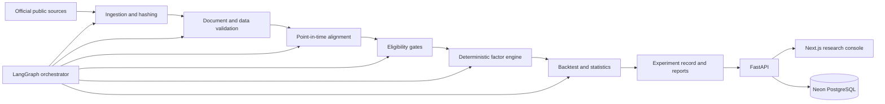

# FactorGraph-NGX

> **Design and Implementation of a Graph-Orchestrated, Point-in-Time Research Platform for Factor Analysis of Nigerian Exchange Equities**

FactorGraph-NGX is an academic research platform for collecting, validating and
analysing publicly available Nigerian Exchange (NGX) equity data. It combines a
deterministic Python research engine with graph-based workflow orchestration,
explicit point-in-time controls and source-level provenance.

The project focuses on the engineering required to produce reproducible factor
research where public data can be incomplete, thin trading can make prices
stale, and financial statements become available after their fiscal periods.
It does not treat missing inputs as observations or present an ineligible factor
as a valid result.

## Research objective

The project aims to design, implement and evaluate a reproducible platform that:

- collects public NGX prices and issuer financial reports;
- validates document identity, dates, coverage and hashes;
- distinguishes official trades from carried market prices;
- aligns fundamentals to their actual or estimated public availability dates;
- evaluates whether the available data is sufficient for each factor;
- performs deterministic factor calculations and pilot backtests; and
- records every experiment's data version, configuration and software revision.

The current evaluation is a **public-data pilot**. It demonstrates the research
workflow without claiming that the observations conclusively validate a
five-factor asset-pricing model for the entire NGX.

## Current data coverage

### Market prices

The processed 2024 dataset contains **3,255 observations** for 15 securities,
covering 217 accepted NGX Daily Official List dates from 2 January through
31 December 2024.

| Ticker | Company | Sector |
| --- | --- | --- |
| ACCESSCORP | Access Holdings | Banking |
| AIICO | AIICO Insurance | Insurance |
| DANGCEM | Dangote Cement | Industrial Goods |
| FBNH | FBN Holdings | Banking |
| GTCO | Guaranty Trust Holding | Banking |
| MTNN | MTN Nigeria Communications | Telecommunications |
| NB | Nigerian Breweries | Consumer Goods |
| NESTLE | Nestlé Nigeria | Consumer Goods |
| OKOMUOIL | Okomu Oil Palm | Agriculture |
| PRESCO | Presco | Agriculture |
| SEPLAT | Seplat Energy | Oil and Gas |
| TOTAL | TotalEnergies Marketing Nigeria | Oil and Gas |
| UBA | United Bank for Africa | Banking |
| WAPCO | Lafarge Africa | Industrial Goods |
| ZENITHBANK | Zenith Bank | Banking |

The source audit retrieved 225 PDFs and accepted 217 as valid Daily Official
Lists, a 96.44% valid-document rate. The dataset records official open, official
close, current market price, staged close, price status and source filename.
Daily volume, traded value and number of transactions remain unavailable in the
public source and are deliberately left missing.

### Point-in-time fundamentals

The pilot targets FY2022 and FY2023 for all 15 issuers, or 30 issuer-periods.
Seven observations have completed page-level review and canonical validation:

- AIICO FY2022 and FY2023;
- Dangote Cement FY2022 and FY2023;
- GTCO FY2023; and
- MTN Nigeria FY2022 and FY2023.

Each observation preserves book equity attributable to owners, period-end
shares outstanding, reporting scope, source units, report URL, document hash,
exact PDF pages and its point-in-time effective date. Two observations use
verified publication dates; five use the declared 90-day fallback. Negative
book equity is retained and excluded from positive book-to-market sorts.

Twelve official annual reports are downloaded and SHA-256 verified. Five
additional reports are ready for statement review. See the
[fundamentals pilot report](research/audit-results/fundamentals-2024-pilot.md)
for the current collection status.

## Factor eligibility

Factors are enabled only after their input gate passes.

| Factor | Current status | Permitted interpretation |
| --- | --- | --- |
| Market | Partial | 15-security market proxy pending NGX ASI history |
| Size | Partial | Pilot only; incomplete point-in-time shares and market capitalisation |
| Value | Partial | Seven verified issuer-period observations |
| Momentum | Pilot-ready | Short-horizon 2024 analysis with stale-price sensitivity controls |
| Liquidity | Blocked | Verified daily volume and traded value are unavailable |
| Regime analysis | Limited | Exploratory pipeline validation; one year is insufficient for strong inference |

The eligibility model is part of the research result: the platform explains why
a calculation is available, preliminary or blocked.

## Architecture



LangGraph coordinates task order, state transfer, retries and failure
isolation. Pandas, NumPy and Statsmodels perform the financial calculations.
Language-model output is not used to generate prices, financial evidence,
factor returns or statistical conclusions.

## Technology stack

- **Frontend:** Next.js, TypeScript and Tailwind CSS; deployed on Vercel
- **Backend:** Python 3.12, FastAPI, Pandas, NumPy, Statsmodels and LangGraph;
  deployed on Railway
- **Database:** PostgreSQL hosted by Neon
- **Package management:** pnpm for the frontend and uv for Python

## Monorepo structure

```text
factorgraph-ngx/
├── apps/
│   ├── api/                    # FastAPI, data pipeline and research engine
│   │   ├── app/
│   │   │   ├── api/           # REST endpoints
│   │   │   ├── data/          # ingestion, evidence and validation
│   │   │   ├── factors/       # deterministic factor modules
│   │   │   ├── graph/         # graph state and orchestration
│   │   │   ├── quant/         # statistics and backtesting
│   │   │   └── db/            # SQLAlchemy models and repositories
│   │   ├── scripts/           # reproducible data and experiment commands
│   │   └── tests/
│   └── web/                    # Next.js research console
├── data/
│   ├── collection/            # reviewed collection worksheets
│   ├── manifests/             # URLs, hashes and retrieval metadata
│   ├── processed/             # generated validated datasets
│   ├── raw/                   # ignored source documents
│   ├── templates/             # canonical CSV schemas
│   └── universes/             # versioned research universes
├── documentation/             # approved academic chapters
├── docs/                      # technical documentation
└── research/audit-results/    # committed validation and coverage reports
```

## Data integrity controls

The pipeline applies:

- source URL and retrieval metadata;
- SHA-256 hashes for accepted documents;
- internal report-date validation;
- duplicate ticker-date and non-positive-price checks;
- explicit carried-price flags and unchanged-price runs;
- exact annual-report page citations;
- consolidated-versus-company reporting scope;
- independent monetary and share-count units;
- actual publication dates where verifiable;
- labelled fixed-lag estimates where dates are unavailable; and
- factor-specific coverage gates.

## First deterministic experiment

The repository includes a reproducible 2024 pilot that builds two return
series for every security:

- `marked_return`, calculated from every staged closing price; and
- `official_trade_return`, calculated only between consecutive observations
  identified as official trades.

It also produces monthly equal-weight market proxies, a three-month momentum
snapshot and machine-readable eligibility decisions for Market, Size, Value,
Momentum and Liquidity. Build it from `apps/api`:

```powershell
$env:PYTHONPATH='.'
uv run python scripts/build_public_data_experiment.py `
  --prices ../../data/processed/ngx-dol-2024-15-security.csv `
  --fundamentals ../../data/collection/fundamentals-2024-pilot.csv `
  --daily-output ../../data/processed/ngx-2024-daily-returns.csv `
  --monthly-output ../../data/processed/ngx-2024-monthly-returns.csv `
  --characteristics-output ../../data/processed/ngx-2024-point-in-time-characteristics.csv `
  --report ../../research/audit-results/ngx-public-data-2024-pilot.json `
  --api-report app/data/reports/pilot-latest.json `
  --momentum-months 3
```

When reviewed market inputs are available, add:

```powershell
  --benchmark ../../data/collection/benchmark.csv `
  --risk-free ../../data/collection/risk-free.csv `
  --universe ../../data/universes/ngx-15-2024.json `
  --benchmark-code NGXASI `
  --risk-free-tenor 91D
```

The experiment validates unique dated observations, selects each calendar
month's final benchmark level and quoted rate, converts the annual percentage
rate to an effective monthly return, and calculates `market_return -
risk_free_return`. Both files are required together; until they contain valid,
aligned observations, the Market factor remains preliminary.

The committed 2024 pilot inputs contain official NGX weekly ASI closes and CBN
91-day NTB auction marginal rates. Consequently, “final benchmark level” means
the last weekly close available during each month, which is preserved as a
pilot-frequency limitation in the source review.

The API exposes the result through:

```text
GET /api/v1/experiments/pilot/latest
GET /api/v1/factors
GET /api/v1/factors/{factor}
GET /api/v1/factors/market/history
GET /api/v1/factors/size/characteristics
GET /api/v1/factors/value/characteristics
GET /api/v1/portfolios/ngx-public-data-2024-pilot-v1
GET /api/v1/portfolios/ngx-public-data-2024-pilot-v1/holdings
GET /api/v1/portfolios/ngx-public-data-2024-pilot-v1/performance
GET /api/v1/companies
GET /api/v1/companies/{ticker}
GET /api/v1/companies/{ticker}/prices
GET /api/v1/companies/{ticker}/fundamentals
```

The Next.js console reads these endpoints and shows blocked factors as blocked;
it does not substitute demonstration statistics for missing research results.
The portfolio view exposes a preliminary three-month Momentum pilot. Formation
returns are lagged by one month, holdings are equally weighted, and a 50-basis-
point transaction-cost assumption is applied to measured turnover. Its eight
invested months are insufficient for a general factor-performance conclusion.

The Size and Value characteristic endpoints perform an as-of join using each
fundamental observation's `effective_from` date. They expose eligible and
excluded security-months separately. Market-capitalisation and book-to-market
rankings remain descriptive until broader issuer coverage permits defensible
SMB and HML return portfolios.

Every generated experiment records SHA-256 identities for its input files, a
stable dataset fingerprint, its numerical configuration, the Git commit, and
whether the working tree contained uncommitted changes. Company endpoints are
derived from the declared 15-security universe and computed report.

Raw licensed or confidential data must not be committed. Public source files in
`data/raw/` are also ignored so datasets remain reproducible from their
manifests without unnecessarily enlarging the repository.

## Local development

### Backend

```powershell
cd apps/api
uv sync
uv run alembic upgrade head
uv run uvicorn app.main:app --reload
```

The API runs at `http://localhost:8000`, with Swagger documentation at
`http://localhost:8000/docs`.

### Frontend

```powershell
cd apps/web
pnpm install
pnpm dev
```

The frontend runs at `http://localhost:3000`.

### Tests

```powershell
cd apps/api
uv run pytest
```

## Environment variables

Backend (`apps/api/.env`):

```env
APP_ENV=development
DATABASE_URL=
FRONTEND_URL=http://localhost:3000
FUNDAMENTALS_REVIEWER=
FUNDAMENTAL_REPORTING_LAG_DAYS=90
LOG_LEVEL=INFO
```

Frontend (`apps/web/.env.local`):

```env
NEXT_PUBLIC_API_URL=http://localhost:8000/api/v1
```

## Deployment

- Deploy `apps/web` to Vercel.
- Deploy `apps/api` to Railway.
- Configure the Neon PostgreSQL connection through `DATABASE_URL`.
- Run `uv run alembic upgrade head` against the production database.
- Start the API with:

```bash
uv run uvicorn app.main:app --host 0.0.0.0 --port $PORT
```

## Research integrity

FactorGraph-NGX does not fabricate or silently impute financial evidence.
Missing observations remain missing unless an explicit, documented
transformation is applied. Every reported result must be traceable through the
experiment configuration, canonical input observations and source manifests.

The platform is intended for academic research and software-engineering
evaluation. It does not provide investment advice.

## Author

**Samuel Justin Ifiezibe**<br>
Department of Software Engineering<br>
Federal University of Technology, Owerri
