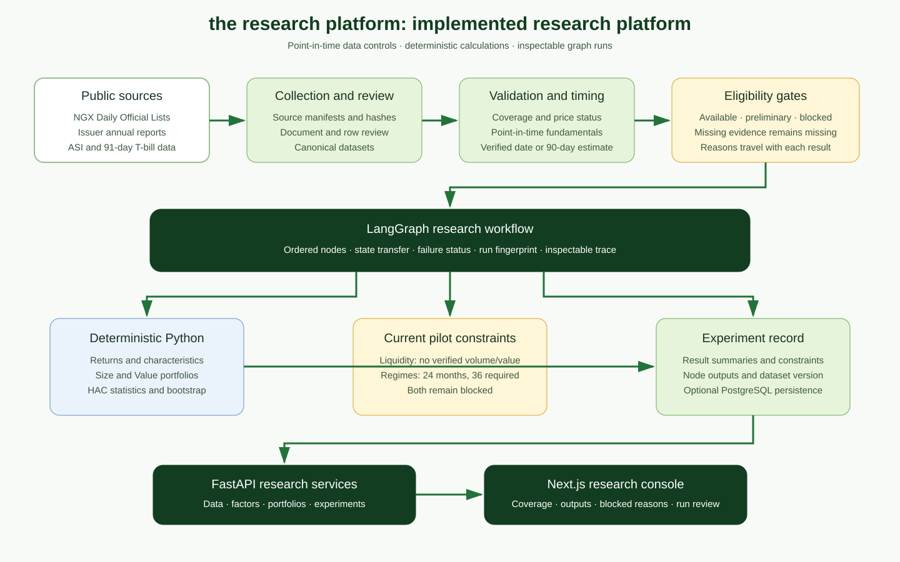
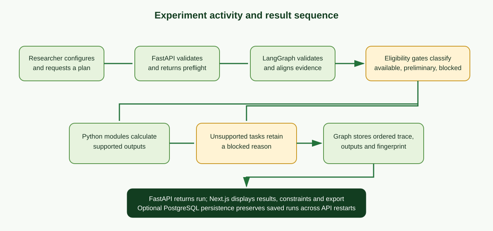

# CHAPTER FOUR

# SYSTEM IMPLEMENTATION, TESTING AND EVALUATION

## 4.1 Introduction

This chapter explains how the system design in Chapter Three was implemented and evaluated. It describes the development environment, application modules, database model, data workflow, quantitative functions, experiment execution, and interface. It then presents the public-data audit and pilot results.

The implemented system is a deterministic research platform for public NGX data. It coordinates calculations through a graph and exposes them through a web application and API. The pilot covers January 2023 to December 2024. Its results are preliminary. This chapter does not report a complete five-factor model, a calculated Liquidity factor, or estimated market regimes.

## 4.2 Implementation Environment

The repository is a monorepo with a Next.js application and a Python API. The package files declare the software dependencies. Hosting providers are configuration targets and do not by themselves establish that production services are active.

| Component | Implemented technology |
|---|---|
| Web client | Next.js 15, React 19, TypeScript 5.7 |
| UI and charts | Tailwind CSS, Recharts, Lucide React |
| API | Python 3.12 and FastAPI |
| Data and calculations | Pandas, NumPy, SciPy, Statsmodels |
| Workflow | LangGraph state graph |
| Request and response schemas | Pydantic |
| Relational storage | PostgreSQL through SQLAlchemy |
| Schema changes | Alembic migrations |
| Python test tools | Pytest and pytest-asyncio |
| Intended hosting | Vercel for the web client, Railway for the API, Neon for PostgreSQL |

Local development can run the API without PostgreSQL. In that mode, experiment records use the configured in-memory repository. Database persistence requires a valid DATABASE_URL and applied migrations.

**Figure 4.1: Target deployment topology.**

## 4.3 Realisation of the System Design

The implementation separates public data collection, review, calculation, orchestration, service delivery, and presentation. Raw sources are processed into validated research files and reports. The experiment service loads the canonical report, builds a preflight plan, invokes the research graph, and returns the output to the API. The web client displays the data and status.

**Figure 4.2: Implemented research platform architecture.**

The UML diagrams in Chapter Three describe the implemented components and their interactions. The following module map connects that design to the repository.

### 4.3.1 Application Modules

| Responsibility | Representative implementation | Function |
|---|---|---|
| API entry and routing | apps/api/app/main.py; app/api/router.py | Creates the service and mounts versioned routes. |
| Dataset and source processing | app/data/ingestion.py; validation.py; ngx_dol.py | Reads and validates price and source observations. |
| Fundamentals and evidence | app/data/fundamentals.py; annual_reports.py; fundamentals_review.py; provenance.py | Maintains reviewed issuer observations, point-in-time dates, and source evidence. |
| Market inputs and quality | app/data/market_inputs.py; market_sources.py; quality.py | Processes benchmark and risk-free series and exposes data-quality reports. |
| Factor characteristics | app/factors/characteristics.py; size.py; value.py; momentum.py; eligibility.py | Calculates or gates security-level factor characteristics. |
| Quantitative engine | app/quant/return_engine.py; characteristic_portfolios.py; momentum_pilot.py; statistics.py; regressions.py; regimes.py | Calculates returns, portfolio sorts, statistics, regression diagnostics, and regime readiness. |
| Workflow orchestration | app/graph/state.py; nodes.py; graph.py | Defines graph state, ordered nodes, execution trace, and node outputs. |
| Experiment service and persistence | app/services/experiments.py; app/db/experiment_repository.py | Builds plans, fingerprints runs, executes graphs, and persists saved runs when configured. |
| Web interface | apps/web/components/research-console.tsx; apps/web/lib/api.ts | Presents data status, factors, portfolios, regime readiness, and experiment runs. |
| Reproducible commands and checks | apps/api/scripts/; apps/api/tests/ | Builds data products and contains automated tests for parsers, calculations, APIs, and workflows. |

The service uses distinct modules so that data preparation and financial formulas do not reside in the page components. The graph calls Python modules and stores their outputs in the research state. The API serialises those results for the web client.

### 4.3.2 Database Implementation

The PostgreSQL schema is defined through SQLAlchemy models. The principal entities are listed in Table 4.1. Price and fundamental activity fields can be null where the source does not provide them. This design preserves absence instead of storing an invented zero.

| Entity | Stored information |
|---|---|
| companies | Ticker, ISIN, name, sector, listing and delisting dates, active status |
| security_identifiers | Ticker and ISIN history with validity dates |
| price_observations | OHLC, adjusted close, volume, traded value, transaction count, date, and dataset version |
| fundamental_observations | Fiscal period, publication date, effective date and source, book equity, shares, other financial fields, source document |
| corporate_actions | Action date and type, adjustment factor, cash amount, and details |
| benchmark_observations | Benchmark code, date, close, adjusted close, and dataset version |
| risk_free_observations | Observation date, tenor, annualised rate, and dataset version |
| dataset_versions | Version label, source, coverage period, manifest, and creation time |
| experiments | Name, configuration, status, dataset-version label, timestamps, trace, node outputs, constraints, errors, fingerprint, last completed node |

**Table 4.1: Principal database entities in the implemented schema.**

The schema applies database constraints for unique security identifiers, positive close prices, non-negative volume and trading value when present, positive shares outstanding when present, and unique observation keys. Company-linked observations use foreign keys. Dataset-version identifiers connect source-derived rows to the relevant snapshot where supplied.

**Figure 4.3: Core relational data model.**

The experiment record stores its dataset-version label and graph data. It does not claim that every version field is a relational foreign key. Persistence of experiments and graph outputs is optional in local operation.

## 4.4 Implementation of Core Functions

### 4.4.1 Source Collection and Provenance

Collection scripts retrieve or process public NGX Daily Official List files, annual reports, benchmark observations, and risk-free data. Manifests record URLs, retrieval outcomes, accepted files, and hashes. Annual-report review records cite the pages used for book equity and shares outstanding and preserve monetary units, share units, reporting scope, and effective-date evidence.

The platform uses these records to connect generated outputs with their source inputs. It does not embed private credentials in the data products. Raw documents remain subject to their source terms.

### 4.4.2 Daily Prices and Return Series

The 15-security merged panel contains 6,375 security-date rows over 425 dates between 3 January 2023 and 31 December 2024. The panel records official price fields, staged close, price status, ticker, date, and source document.

The return engine calculates two separate series. Marked-price returns use consecutive staged closing prices. Official-trade returns use consecutive observations classified as official trades. The panel produces 6,360 marked close-to-close returns and 1,320 returns between consecutive official-trade observations. A total of 5,041 staged rows are classified as carried prices. This high carried-price count makes marked-price results sensitive to stale observations.

### 4.4.3 Fundamentals and Point-in-Time Characteristics

The reviewed fundamentals collection contains 30 issuer-period records for 15 companies and fiscal years 2022 and 2023. All rows passed the project's review and canonical validation workflow. Eight publication dates are verified from source evidence. Twenty-two records use the declared 90-day reporting-lag estimate.

The as-of join selects the latest record whose effective date is no later than the portfolio formation date. Market capitalisation is calculated from the available price and shares outstanding. Book-to-market is calculated only when book equity is positive. Two negative book-equity observations remain in the reviewed source data and are not used in positive book-to-market sorts.

The effective date is distinct from the fiscal period end. This prevents the system from treating all annual-report figures as if they were public at the close of the fiscal year.

### 4.4.4 Benchmark and Risk-Free Inputs

The market-input workflow reads NGX All-Share Index observations and the Central Bank of Nigeria 91-day Treasury-bill rate. Each file covers 24 months from January 2023 through December 2024. The experiment builder selects the available monthly observation and converts the annualised rate into a monthly rate under the declared method.

The aligned files produce 23 monthly market-excess observations. The benchmark frequency and availability are retained in the audit report. These observations provide a pilot market comparison and do not constitute a daily benchmark history.

### 4.4.5 Factor Eligibility and Construction

The eligibility layer evaluates the inputs before reporting a factor result. “Eligible” means that the input gate permits a calculation. It does not mean that the factor is statistically validated.

The Market series subtracts the aligned risk-free return from the market return. Size ranks securities by point-in-time market capitalisation. Value ranks positive book-to-market ratios. The Size and Value portfolio module forms equal-weighted Small-minus-Big and High-minus-Low spreads using month-end formation and following-month returns.

Momentum ranks securities using a 12–1 formation return. The pilot can form ranks, but the regression sample has 11 complete observations. It does not meet the configured 12-observation regression threshold.

The available daily lists do not provide verified volume and traded value. A price-only measure cannot replace those fields for liquidity analysis. Liquidity remains blocked. The system reports the missing requirements rather than constructing an unsupported proxy.

### 4.4.6 Portfolio Statistics and Regression Diagnostics

The portfolio-statistics module calculates descriptive returns, annualised summaries, volatility, Sharpe ratios, Newey-West statistics, and bootstrap intervals when the sample contains the required values. The size and value spreads each use 22 monthly observations. Newey-West estimates use lag 4. The bootstrap uses 2,000 iterations and a recorded seed.

Market regression endpoints estimate market exposure with aligned observations and Newey-West errors. A short observation count or missing series is returned with its status. The output is a descriptive pilot result and is not treated as proof of a stable premium.

### 4.4.7 Regime Readiness

The regime workflow prepares monthly market-excess return and rolling three-month volatility features for a three-state Gaussian HMM. The minimum input gate is 36 monthly endpoints. The pilot has 24 monthly endpoints, so the workflow records a blocked readiness result. It does not fit a model, produce state labels, or calculate regime-specific performance for this sample.

### 4.4.8 Experiment Graph and Run Record

The experiment service creates a stable plan from the requested factors, date window, dataset fingerprint, and configuration. The preflight response lists the planned graph nodes and constraints before execution. The LangGraph workflow runs dataset preparation, factor construction, validation, regime readiness, stock ranking, portfolio construction, historical backtesting, benchmark comparison, and persistence.

Each completed node adds its sequence, name, status, and output summary to the execution trace. The run record contains constraints and errors separately. Identical research inputs and stable settings yield the same run fingerprint. Runs with blocked or preliminary requests can complete with constraints so that execution status is not confused with empirical eligibility.

### 4.4.9 API and Web Interface

The FastAPI service groups routes for health, dataset quality, companies, factors, portfolios, regimes, and experiments. The experiment API supports creation, planning, execution, saved-run retrieval, node inspection, manifests, and audit-bundle export. Company routes expose issuer information, prices, and fundamentals. Factor and portfolio routes return histories, diagnostics, holdings, and performance when available.

The Next.js console provides overview, factor laboratory, regime readiness, portfolio, and experiment views. It displays the factor status and constraint beside its result. It does not replace blocked evidence with sample statistics. The API does not place trades.

## 4.5 Research Workflow

The use-case, activity, sequence, component, and state diagrams in Chapter Three define the design. Figure 4.1 follows the implemented research path from source evidence to a saved run.

**Figure 4.4: Implemented experiment workflow and result sequence.**

The workflow starts with an experiment request. FastAPI checks the request and the experiment service creates a preflight plan. The graph then loads the canonical report, applies the requested month window, and executes the ordered nodes. Deterministic modules calculate supported factors and portfolios. Eligibility checks preserve blocked reasons. The graph returns a result that the API displays and can persist.

### 4.5.1 Create and Plan an Experiment

The researcher chooses a date window, factors, portfolio settings, and relevant calculation options. The API returns a plan with the dataset version, selected factors, expected nodes, monthly coverage, eligibility statuses, and run fingerprint. The user can inspect this information before starting the graph.

### 4.5.2 Execute and Inspect a Run

When the researcher starts the run, the API marks the experiment as running and invokes LangGraph. The service returns the final run status, ordered trace, node summaries, constraints, and errors. A researcher can inspect a single node or export an audit bundle containing the configuration and run metadata.

### 4.5.3 Interpret Supported and Blocked Outputs

A completed run can contain factor-specific constraints. Market, Size, and Value outputs pass their input gates for this pilot but remain preliminary. Momentum formation is available while its regression is blocked. Liquidity and regime analysis are blocked. The user interface keeps these statuses visible and distinguishes them from execution failures.

## 4.6 Automated Testing and Technical Evaluation

### 4.6.1 Test Procedure and Test Coverage

The repository contains automated pytest modules for data parsers, annual-report processing, fundamentals review, provenance, point-in-time characteristics, returns, factor eligibility, portfolios, regressions, regime readiness, API routes, and graph execution. Tests use controlled inputs to check expected calculations, response schemas, status values, and blocked reasons.

**Table 4.2: Test coverage represented in the repository**

| Test area | Representative test modules | Behaviour covered |
|---|---|---|
| NGX price and source parsing | test_ngx_dol_parser.py; test_market_sources.py; test_source_documents.py | Price rows, source documents, and manifest-related parsing |
| Fundamental evidence | test_annual_reports.py; test_fundamentals.py; test_fundamentals_review.py; test_fundamentals_completion.py | Report extraction, review rules, evidence status, and completion queue |
| Data integrity | test_provenance.py; test_market_inputs.py; test_dataset_quality_api.py | Input identity, market series, and dataset-quality responses |
| Quantitative calculations | test_return_engine.py; test_characteristics.py; test_characteristic_portfolios.py; test_regressions.py; test_momentum_pilot.py | Returns, point-in-time ranks, portfolio statistics, regression, and momentum formation |
| Eligibility and regimes | test_factor_eligibility.py; test_regimes.py | Factor gate decisions and minimum-sample readiness |
| API and workflow | test_pilot_experiment_api.py; test_experiment_graph_api.py; test_*_api.py | Experiment lifecycle, endpoint schemas, graph trace, and saved outputs |

The listed modules establish the scope of automated checks. This chapter does not report an overall pass count or coverage percentage because no fresh full-suite run was performed for this documentation update. The empirical results below are taken from the committed pilot report.

### 4.6.2 Price and Fundamental Audit Results

The price audit accepted 217 of 225 retrieved Daily Official List PDFs for 2024, a 96.44% document acceptance rate. The full merged panel has 6,375 rows across 15 securities and 425 dates. The system retained 6,360 marked-price returns and 1,320 returns between consecutive official trades.

The 30 fundamental observations passed the canonical evidence workflow with no missing issuer periods. Eight dates are verified publications and 22 use the declared 90-day estimate. Two negative equity observations are excluded from positive Value sorts. The pilot has no verified daily volume or traded value.

### 4.6.3 Descriptive Factor Results

Table 4.3 presents the Size and Value spread results from the pilot. Each series has 22 monthly observations.

| Spread | Mean monthly return | Annualised return | Annualised volatility | Sharpe ratio | Newey-West t-statistic | 95% bootstrap interval for mean |
|---|---:|---:|---:|---:|---:|---:|
| Size: Small minus Big | 1.25% | 11.73% | 28.37% | 0.53 | 0.84 | −2.08% to 4.67% |
| Value: High minus Low | 2.02% | 21.88% | 29.77% | 0.81 | 0.84 | −1.53% to 5.50% |

**Table 4.3: Descriptive Size and Value pilot results.**

Both bootstrap intervals include zero, and both Newey-West t-statistics are small. These figures demonstrate that the characteristic and portfolio workflow runs on the collected sample. They do not establish positive or persistent Size and Value premiums.

The 15-security marked-price equal-weight proxy has 23 monthly observations, a mean monthly return of 4.21%, annualised return of 59.17%, annualised volatility of 25.97%, and Sharpe ratio of 1.95. The official-trade sensitivity series has a mean monthly return of 4.36%, annualised return of 60.95%, annualised volatility of 27.57%, and Sharpe ratio of 1.90. The aligned NGX All-Share Index excess-return series has a mean monthly return of 2.36%, annualised return of 27.66%, annualised volatility of 30.06%, and Sharpe ratio of 0.94. These short and volatile samples are descriptive, not forecasts.

### 4.6.4 Factor Eligibility Results

| Component | Pilot status | Reason and permitted interpretation |
|---|---|---|
| Market | Eligible | 23 aligned monthly excess returns; descriptive pilot only |
| Size | Eligible | 30 reviewed fundamental rows; 22 spread observations; preliminary |
| Value | Eligible | 28 positive-equity rows; 22 spread observations; preliminary |
| Momentum | Formation eligible | 12–1 ranks are formed; regression has 11 complete observations and is blocked |
| Liquidity | Blocked | Verified daily volume and traded value are unavailable |
| Regime model | Blocked | 24 monthly endpoints are below the 36-observation minimum |

**Table 4.4: Factor eligibility and interpretation limits.**

Eligibility permits construction from the available inputs. It does not mean that the factor is statistically validated. The 15-security universe, 24-month period, carried prices, estimated publication dates, and share-count qualifications limit interpretation.

### 4.6.5 Reproducibility and Traceability Evaluation

The pilot builder records input file hashes, configuration, a dataset fingerprint, and software revision metadata. The experiment service creates a stable run fingerprint from the canonical dataset fingerprint and stable configuration fields. Each graph run records node order, status, compact outputs, constraints, and the last completed node. The API can return an audit bundle for a saved run.

These records allow a researcher to identify which inputs and settings produced a result. They do not eliminate errors in source data or the limitations of the research period.

## 4.7 Requirements Coverage Evaluation

Table 4.5 connects the main requirements with implemented evidence. “Implemented” means that the relevant code path and artefact exist in the repository. It does not report a new test-run pass rate.

| Requirement group | Implemented evidence | Evaluation |
|---|---|---|
| Data ingestion and validation | Collection scripts, source manifests, parser tests, price and fundamental audit reports | Implemented for the declared pilot sources |
| Point-in-time control | Reviewed effective dates, 90-day estimates, as-of characteristic engine | Implemented; 22 dates remain estimates |
| Factor calculation | Market, Size, Value, and Momentum modules and pilot report | Preliminary outputs available with gates |
| Liquidity calculation | Eligibility record and missing-input reason | Blocked; verified volume/value absent |
| Regime analysis | Three-state HMM readiness workflow | Blocked; 24 of 36 minimum months |
| Workflow inspection | Preflight plans, LangGraph node trace, fingerprints, node inspection and export | Implemented |
| Presentation and API | Next.js research views and FastAPI routes | Implemented |
| Durable storage | SQLAlchemy models and migrations | Available when PostgreSQL is configured |

**Table 4.5: Requirements-to-implementation evaluation.**

## 4.8 Discussion of Results and Limitations

The project demonstrates a complete software path from source review to an inspectable research run. It preserves differences between marked prices and official trades, aligns fundamentals by effective date, calculates supported characteristics and portfolio spreads, and reports factor-specific constraints through the API and console.

The pilot’s empirical evidence is limited. More than five thousand staged price rows are carried prices, so marked-price returns may be sensitive to stale observations. The official-trade return series is shorter than the marked-price series. Twenty-two of the thirty fundamental effective dates are estimates. GTCO FY2022 shares use gross issued shares because the report gives treasury-share value but not the number of treasury shares. These issues must remain visible when interpreting the Size and Value results.

The sample contains only 15 issuers and two years. Its Size and Value intervals include zero. Momentum has too few complete observations for regression validation. No verified daily activity inputs support Liquidity, and the monthly series is too short for the configured regime model. The project therefore evaluates the platform and pilot workflow. It does not claim that a factor premium has been established, that the results generalise to all NGX equities, or that regime-aware allocation has been tested.

## 4.9 Chapter Summary

This chapter described the implementation environment, software modules, database entities, data controls, quantitative functions, experiment workflow, and research interface. The evaluation reported the public-data audit and descriptive pilot metrics. Size and Value produced preliminary spread series. Market and Momentum outputs are subject to sample limits. Liquidity and regime estimation remain blocked. The system preserves these limitations in its reports and graph-run records so the results can be reviewed in context.

