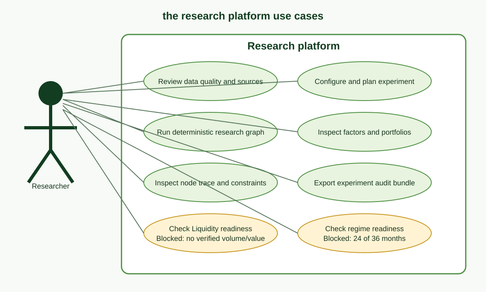
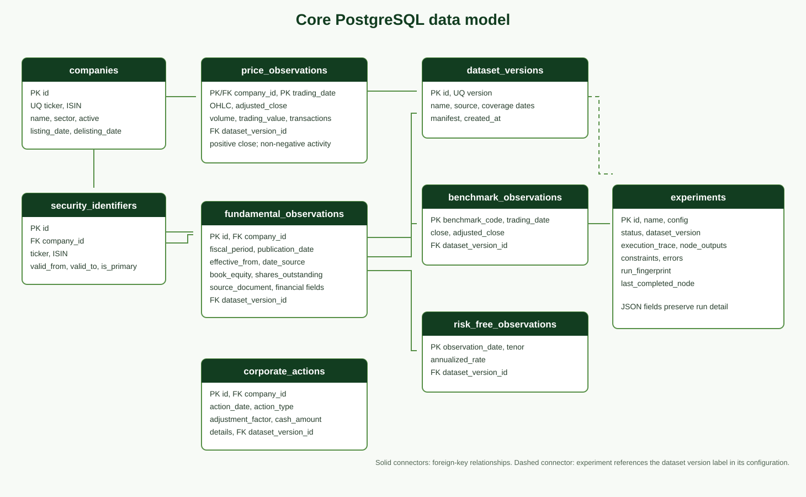
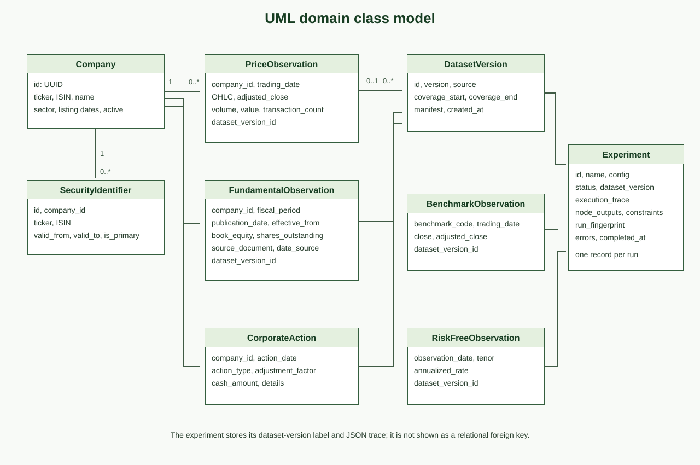
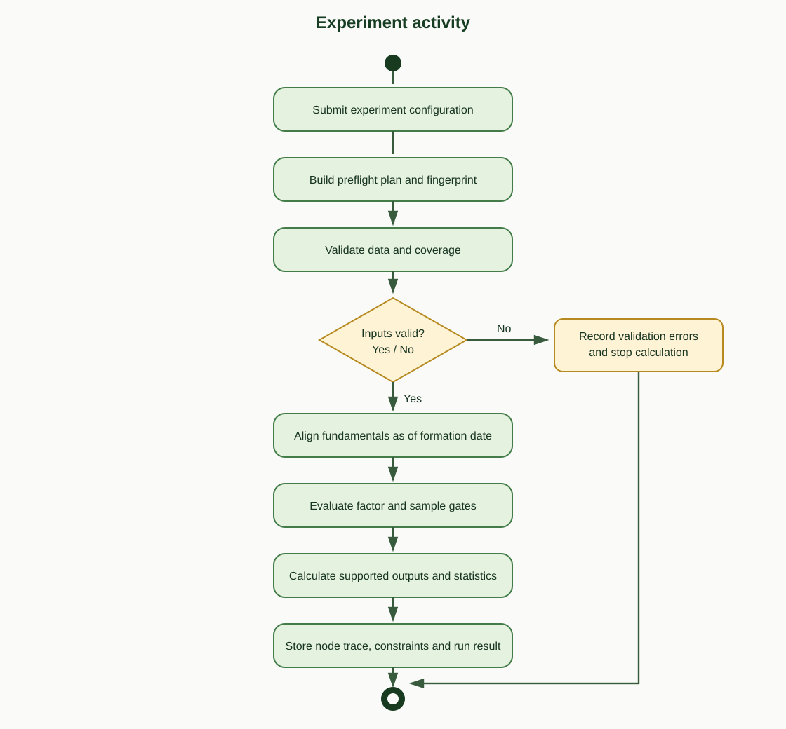
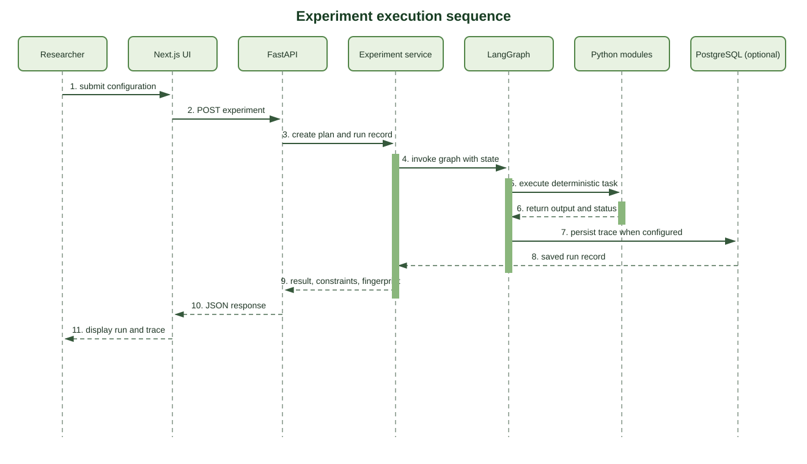
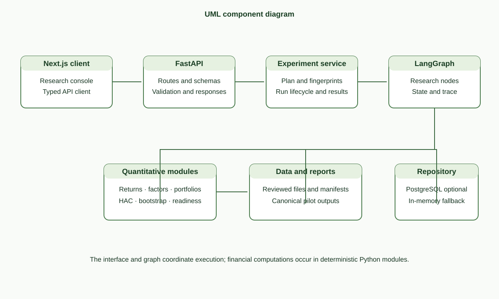
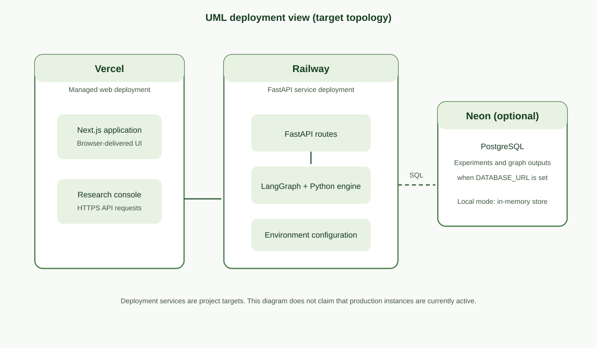
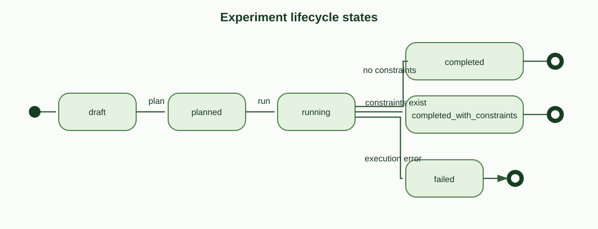

# CHAPTER THREE

# RESEARCH METHODOLOGY AND SYSTEM DESIGN

## 3.0 Introduction

This chapter describes the software-development method, requirements, system design, implementation tools, and testing approach. The study used an iterative and incremental development method. Work proceeded in increments because data collection, point-in-time alignment, quantitative analysis, API development, and the interface depend on one another. Each increment added a usable part of the research platform and informed the next design decisions.

The project began with public NGX source collection and data-quality review. It then added price and fundamentals processing, point-in-time characteristics, return and portfolio calculations, API services, graph execution, persistence options, and the web console. Testing was added as functions and services were developed. The implemented workflow uses deterministic financial modules coordinated by a graph. It reports only analyses supported by the pilot evidence.

The implementation was evaluated with a public-data pilot from January 2023 to December 2024. The pilot covers 15 securities, 6,375 daily security-date observations, and 30 reviewed FY2022 and FY2023 fundamental observations. It supports preliminary Market, Size, Value, and Momentum outputs. Liquidity and regime estimation remain blocked by the available evidence and sample size.

## 3.1 Requirements Elicitation

Requirements were derived from the approved study topic, the public NGX sources that could be collected, the resulting data audit, and the need for repeatable analysis. The requirements were refined as source limitations became clear. The system therefore treats data sufficiency as a requirement: a calculation must be marked preliminary or blocked when its input gate fails.

The functional requirements define the work performed by the platform. Non-functional requirements define how the platform preserves data integrity, provenance, security, and reproducibility.

**Table 3.1: Software requirements and acceptance conditions**

| ID | Requirement | Acceptance condition |
|---|---|---|
| FR-01 | Inspect public NGX market and issuer data. | Supported price, annual-report, benchmark, and risk-free inputs can be represented in the research workflow. |
| FR-02 | Preserve source provenance. | Source URLs, document hashes, cited pages, manifests, and data versions remain linked to inputs or reports. |
| FR-03 | Validate observations. | Invalid dates, duplicate keys, invalid prices, missing required fields, and coverage gaps are reported. |
| FR-04 | Preserve daily price status. | Marked-price and official-trade returns are calculated and reported separately. |
| FR-05 | Align fundamentals point in time. | The selected fundamental observation has an effective date no later than the formation date. |
| FR-06 | Evaluate factor eligibility. | The system reports eligible, preliminary, or blocked status with reasons. |
| FR-07 | Calculate supported research outputs. | Deterministic modules produce market returns, Size and Value sorts, Momentum formation ranks, and applicable statistics. |
| FR-08 | Check regime-model readiness. | The sample minimum is evaluated before HMM fitting; an insufficient sample remains blocked. |
| FR-09 | Execute and inspect an experiment. | The graph records ordered node status, output summaries, constraints, and a run fingerprint. |
| FR-10 | Provide research API and web views. | Clients can request dataset, company, factor, portfolio, regime-readiness, and experiment information. |
| FR-11 | Persist experiment runs when configured. | PostgreSQL stores experiment state and graph outputs when a database connection is configured. |
| NFR-01 | Support reproducibility. | The data version, stable configuration, input fingerprints, and software revision can be identified. |
| NFR-02 | Limit look-ahead bias. | Fundamentals are selected only after their verified or declared estimated effective date. |
| NFR-03 | Preserve missing evidence. | Missing activity or sample information is not converted into a zero observation or an unsupported output. |
| NFR-04 | Report workflow failures clearly. | A failed or constrained node is visible in the run status and trace. |
| NFR-05 | Separate concerns. | User-interface code does not perform financial calculations; Python modules own quantitative operations. |

## 3.2 System Design

The platform uses a layered design. The presentation layer uses Next.js and TypeScript. The service layer uses FastAPI and typed request and response models. Deterministic Python modules perform data preparation, factor calculations, statistical analysis, and portfolio operations. LangGraph coordinates the ordered research nodes. PostgreSQL provides optional durable storage for experiments and graph outputs.

The data workflow starts with public source documents and structured files. Scripts and review worksheets record the source and validation evidence. The canonical pilot report supplies the experiment workflow. The system aligns fundamentals to effective dates, evaluates factor gates, calculates supported outputs, records node results, and returns an inspectable experiment record.

The diagrams in this section use standard UML concepts for actors, classes, activities, interactions, components, deployment nodes, and state transitions. They describe the implemented software and distinguish optional or blocked functions from current pilot results. UML 2.5.1 provides the notation reference (Object Management Group, 2017).

### 3.2.1 Use Case Diagram

The primary actor is the researcher. The researcher reviews data quality, configures an experiment, requests a preflight plan, starts a run, examines factors and portfolio results, reviews graph nodes and constraints, and exports an audit bundle. The platform validates inputs and runs supported calculations. It also reports Liquidity and regime readiness, which are blocked for the current pilot.

**Figure 3.1: UML use-case diagram for the research platform.**

### 3.2.2 Data Model

The data model separates issuer identity, time-varying security identifiers, observations, source-data versions, and experiments. In the relational schema, a company can have multiple security identifiers and multiple price, fundamental, and corporate-action observations. Price, fundamental, benchmark, risk-free, and corporate-action rows may reference a dataset version. An experiment stores its configuration, status, trace, node outputs, constraints, errors, and run fingerprint. Its dataset-version label is stored in the experiment record.

The model does not imply that the current pilot has values for every schema field. For example, the schema can hold trading volume and value, but those values remain unavailable in the reviewed daily price inputs.

**Figure 3.2: Core relational data model.**

The following domain classes show the main attributes and associations used by the application.

**Figure 3.3: UML domain class diagram..**

### 3.2.3 Activity Diagram

The activity begins when the researcher submits an experiment configuration. The service builds a preflight plan and checks the dataset. If validation fails, the workflow records the error and stops downstream calculations. If validation passes, the workflow aligns fundamentals to the formation date and checks factor-specific input and sample gates. It calculates supported outputs and retains blocked reasons for unsupported analyses. The run trace and final status are then stored or returned.

**Figure 3.4: UML activity diagram for experiment execution.**

### 3.2.4 Sequence Diagram

The sequence diagram shows the interaction between the researcher, web client, API, experiment service, LangGraph, deterministic Python modules, and optional PostgreSQL storage. The researcher first requests a plan and then starts the run. The graph calls the modules in sequence. The service returns the run status, constraints, fingerprint, and trace to the web client. Database persistence occurs only when configured.

**Figure 3.5: UML sequence diagram for an experiment run..**

### 3.2.5 Component Diagram

The component diagram shows the software responsibilities and dependencies. The Next.js client calls FastAPI. The experiment service invokes LangGraph. Graph nodes use data and quantitative modules. The modules read canonical pilot reports and return calculations to the graph. Optional persistence stores experiment records. The Python quantitative modules do not depend on the page layout.

**Figure 3.6: UML component diagram of the implemented software.**

### 3.2.6 Deployment Diagram

The target deployment uses Vercel for the Next.js interface, Railway for the FastAPI service, and Neon as the optional hosted PostgreSQL database. The service reads deployment settings from environment variables. In local development, the API can use in-memory experiment storage if no database URL is set. The diagram shows the intended topology; it does not claim that production instances are active.

**Figure 3.7: UML deployment diagram for the target hosting topology.**

### 3.2.7 Experiment State Diagram

An experiment begins in draft state. The planning operation creates the plan and fingerprint. Execution moves the run to running. A run ends as completed when it has no declared constraints, completed_with_constraints when one or more selected analyses are preliminary or blocked, or failed when execution cannot complete. The record retains errors and the last completed node for inspection.

**Figure 3.8: UML state machine for experiment lifecycle.**

## 3.3 System Implementation

Implementation keeps data collection, review, quantitative calculations, graph orchestration, API services, persistence, and presentation in separate modules. Source collection and evidence review happen before the experiment builder creates the canonical pilot report. The report is then read by the experiment and API services.

### 3.3.1 Front-end Tools

The presentation layer uses Next.js 15, React 19, and TypeScript. It provides overview, factor, regime-readiness, portfolio, and experiment views. React Query supports API data loading, Recharts displays research series, and Lucide provides interface icons. The research console displays factor status and reasons for blocked outputs. The frontend is configured for deployment on Vercel.

### 3.3.2 Back-end Tools

The service layer uses Python 3.12 and FastAPI. Pydantic defines request and response schemas. Pandas and NumPy support tabular and numerical operations. SciPy and Statsmodels support quantitative analysis, including Newey-West statistics. LangGraph coordinates the experiment nodes. Pytest, pytest-asyncio, and Ruff are included in the development toolchain.

Financial calculations reside in deterministic Python modules. Graph nodes transfer state and record status. They do not use a language model to create or adjudicate financial evidence.

### 3.3.3 Database

PostgreSQL is the relational database option. SQLAlchemy defines the models and data access. Alembic manages schema migrations. The schema includes companies, security identifiers, price observations, fundamental observations, corporate actions, benchmark observations, risk-free observations, dataset versions, and experiments.

The experiment table stores configuration, status, completion time, ordered execution trace, node outputs, constraints, errors, fingerprint, and last completed node. A configured DATABASE_URL enables persistence. Without it, the local API can use in-memory experiment storage.

### 3.3.4 Data Ingestion and Validation

The data workflow contains parsers and services for NGX Daily Official Lists, annual reports, market inputs, fundamentals, source documents, quality reports, and provenance. Scripts collect or process the source material and produce manifests, canonical observations, and audit reports.

Daily price validation checks date and security keys, required price values, and accepted source documents. Source status distinguishes official trades from carried price rows. Fundamental review records book equity, shares, units, reporting scope, cited pages, source document, hash, and effective-date evidence. Negative book equity is preserved in the evidence but excluded from positive book-to-market sorting.

### 3.3.5 Point-in-Time Alignment

The alignment module selects the most recent fundamental observation whose effective date is on or before a formation date. A verified filing date is preferred. When it is not available, the configured 90-day estimate is used and labelled as an estimate.

Market capitalisation uses the available price and shares outstanding. Book-to-market uses book equity divided by market capitalisation only when book equity is positive. These rules preserve the timing and eligibility of each characteristic.

### 3.3.6 Factor Construction

The return engine produces marked-price returns and official-trade returns separately. Marked-price returns use consecutive staged closing prices. Official-trade returns use consecutive records classified as official trades.

The Market excess-return series subtracts the aligned risk-free return from the market return. Size ranks eligible securities by market capitalisation. Value ranks them by point-in-time book-to-market. The monthly Size and Value spreads use equal-weighted portfolios and are preliminary.

Momentum uses a 12–1 formation period. It compounds returns from month t−12 through month t−2 and skips the latest month. Formation ranks can be created for the pilot, but the available regression series has only 11 complete observations and does not pass the 12-observation minimum.

The schema and eligibility layer include Liquidity, but no Liquidity factor is calculated for the current pilot. Verified daily volume and traded value are absent. The system reports the factor as blocked.

### 3.3.7 Statistical Validation

When the sample supports a calculation, the quantitative modules report observation count, average return, annualised measures, volatility, Sharpe ratio, Newey-West statistics, regression diagnostics, and bootstrap confidence intervals. Bootstrap calculations use an explicit seed so the same configuration can be repeated.

Statistics are interpreted in the context of the sample. Newey-West estimates and bootstrap intervals do not correct incomplete inputs or the limited length of the pilot. The system reports preliminary and blocked status with the numeric output.

### 3.3.8 Regime, Portfolio, and Backtest Modules

The portfolio engine forms monthly Size and Value sorts and records following-month holdings and returns. The backtest and transaction-cost modules support portfolio return, turnover, and cost calculations when the required observations are present. The Momentum pilot produces formation and portfolio information but has too few complete observations for regression validation.

The regime module prepares monthly market-return and rolling-volatility features for a three-state Gaussian HMM. It checks for at least 36 monthly endpoints. The current 24-month pilot does not pass this gate, so the module does not assign states or report regime-specific performance.

### 3.3.9 Workflow and API

FastAPI exposes data-quality, company, factor, portfolio, regime-readiness, and experiment resources. Experiment operations create a configuration, build a preflight plan, execute a graph, retrieve a saved run, inspect an individual node, return a manifest, and export an audit bundle.

LangGraph executes the ordered nodes for dataset preparation, factor construction, validation, regime readiness, stock ranking, portfolio construction, historical backtest, benchmark comparison, and persistence. Each node records a sequence number, status, and compact output. Run-level results include constraints, errors, dataset version, last completed node, and a stable run fingerprint.

## 3.4 System Testing

The repository contains automated tests for source parsing, annual-report processing, fundamental review and completion, point-in-time characteristics, price returns, factor eligibility, portfolio construction, regressions, regimes, API routes, provenance, and experiment graph runs.

Tests use controlled inputs to check expected calculations, validation decisions, API response structures, gate reasons, and graph trace behaviour. These tests provide software-level evidence. They do not establish that the empirical results generalise beyond the 2023–2024 pilot.

### 3.4.1 Unit Testing

Unit tests exercise parsing rules, date alignment, returns, market capitalisation, book-to-market, eligibility decisions, portfolio statistics, bootstrap repeatability, and regime minimum-sample checks. Valid and invalid inputs are used to check accepted results and blocked cases.

### 3.4.2 Component Testing

Component tests connect related modules, including source parsing with validation, fundamental alignment with characteristic formation, portfolio construction with statistical summaries, and graph nodes with report data. These tests check that status and explanatory reasons move with the calculated outputs.

### 3.4.3 Integration Testing

API and graph tests cover experiment planning, execution, run retrieval, node inspection, constraints, fingerprints, and exports. Dataset, company, factor, portfolio, and regime API tests check that the services expose the expected research outputs. PostgreSQL persistence is tested only with a configured database connection.

### 3.4.4 Efficiency Testing

The completed pilot records its observation counts and coverage, including securities, dates, monthly endpoints, and factor return counts. The project does not report production load-test results or a formal concurrency benchmark. API response-time claims are therefore outside the current evaluation.

## 3.5 Summary

This chapter described the iterative development method, system requirements, UML design, and implementation approach. The design includes use-case, domain-class, activity, sequence, component, deployment, and experiment-state diagrams. The implementation uses Next.js, FastAPI, deterministic Python modules, LangGraph orchestration, and optional PostgreSQL persistence. The pilot supports preliminary Market, Size, Value, and Momentum outputs. Liquidity and regime estimation remain blocked by documented data and sample constraints.

## REFERENCES

Object Management Group. (2017). *OMG Unified Modeling Language (OMG UML), version 2.5.1*. https://www.omg.org/spec/UML/2.5.1/PDF

